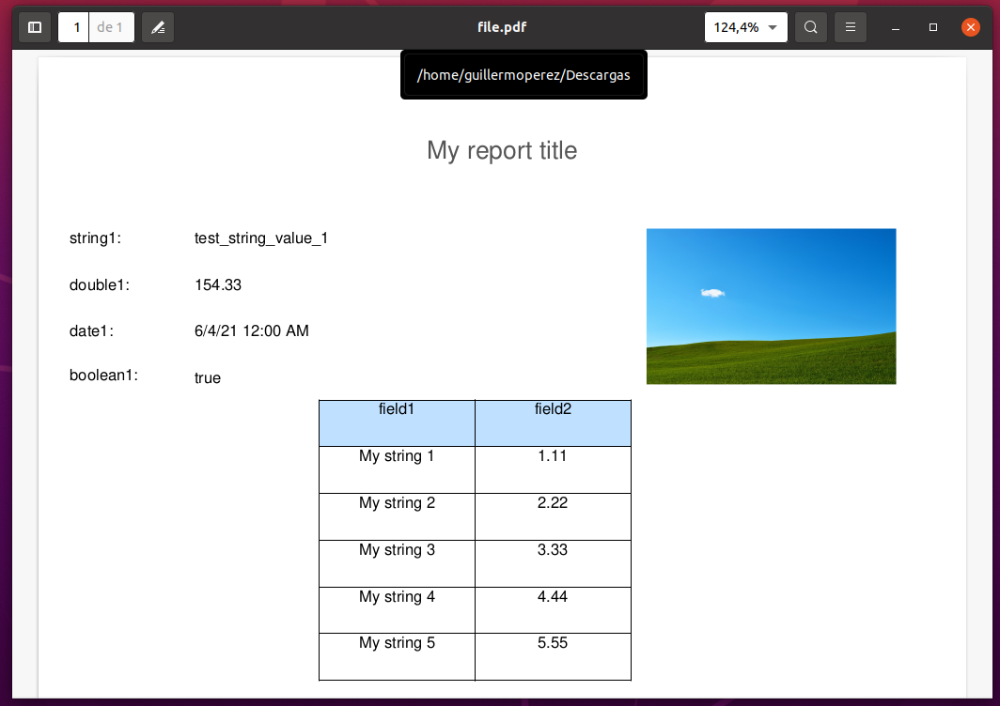

# generic-jasper-reports-with-aws-lambda
Generic [JasperReports](https://community.jaspersoft.com/project/jasperreports-library) Service using [AWS Lambda](https://aws.amazon.com/es/lambda/)

This repo contains code for a Java JasperReport Lambda function.
It is based on AWS sample code: [Jasper Reports with Lambda, RDS and API Gateway](https://github.com/aws-samples/jasper-reports-with-lambda-rds)

In this case we do not use an RDS connection. The parameters and data sources to include in the report are passed in the body of POST call.

The use of [SDK1](https://github.com/aws/aws-sdk-java) has also been changed to [SDK2](https://github.com/aws/aws-sdk-java-v2) to increase speed and improve performance.

## Content summary:

* Java Maven code
* AWS IaC Files: CloudFormation stack & API swagger
* Test files: JasperReports test template & Postman collection
* Basic scripts to automate process: build application, create AWS buckets, syncronize resources & launch CloudFormation stack

## Requirements

All step scripts uses Docker. No additional software (java, maven or aws-cli) is required.

## Usage steps

1. [Get AWS credentials](https://docs.aws.amazon.com/en_en/general/latest/gr/aws-sec-cred-types.html#access-keys-and-secret-access-keys).
2. Modify *aws_config/credentials* file with correct values.
3. Review *aws_config/config* file to ensure that region is correct.
4. Review *lambda_config.sh* file to ensure correct values for all properties, specially *region*, *files_s3_bucket* and *templates_s3_bucket*. The two last properties must be unique in AWS. Otherwise these cannot be created. See [Amazon S3 Bucket Naming Requirements](https://docs.aws.amazon.com/awscloudtrail/latest/userguide/cloudtrail-s3-bucket-naming-requirements.html).
5. Set execute permissions to all *.sh* files.
6. Execute *00.launch_all_steps.sh* or execute the steps you want.
7. When all scripts ends, go to AWS Web Console to check CloudFormation creation stack status.
8. Wait until stack creation is complete and go to API Gateway to copy URL.
9. Paste API URL into Postman call & launch test example.
10. Enjoy !!

